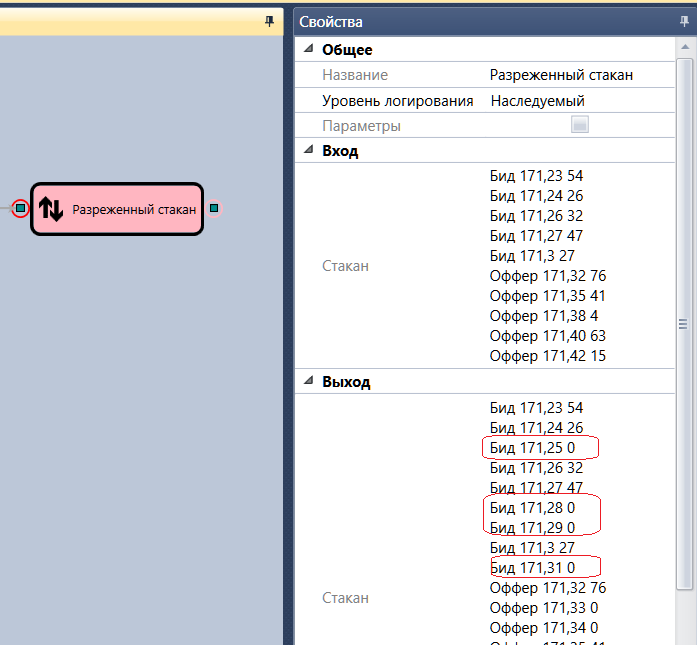

# Разреженный стакан

Кубик используется для получения разреженного стакана по заданному.

### Входящие сокеты

Входящие сокеты

- **Стакан** – стакан, который надо разредить.

### Исходящие сокеты

Исходящие сокеты

- **Стакан** – разреженный стакан.

## См. также

[Обрезанный стакан](Designer_MarketDepthTruncateDiagramElement.md)
