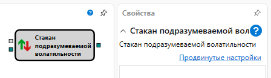

# Стакан подразумеваемой волатильности

Кубик используется для расчета стакана подразумеваемой волатильности.

### Входящие сокеты

Входящие сокеты

- **Модель** – модель расчета (например, Блэк-Шоулз).
- **Стакан** – стакан.

### Исходящие сокеты

Исходящие сокеты

- **Стакан** – значения стакана подразумеваемой волатильности.

## См. также

[Доска опционов](Designer_Options_Board.md)
