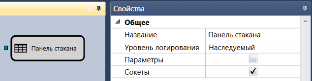

# Панель стакана

Кубик предназначен для отображения стакана в специальном графическом компоненте [Стакан](Designer_Depth_Panel2.md).

Компонент [Стакан](Designer_Depth_Panel2.md) необходимо добавить из группы [Компоненты](Designer_Components.md) вкладок **Эмуляция** или **Торговля**. Более подробно о компоненте [Стакан](Designer_Depth_Panel2.md) можно узнать в пункте [Стакан](Designer_Depth_Panel2.md). 

### Входящие сокеты

Входящие сокеты

- **Стакан** – стакан, который надо отобразить.

## См. также

[Сгруппированный стакан](Designer_Depth_Grouped.md)
