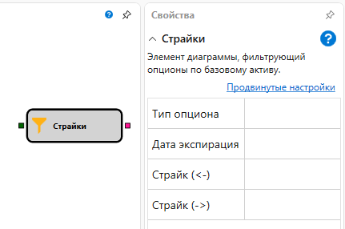

# Деривативы

Кубик используется для получения списка опционов по заданному фильтру.

#### Входящие сокеты

Входящие сокеты

- **Инструмент** – инструмент, базовый актив.

#### Исходящие сокеты

Исходящие сокеты

- **Опционы** – список опционов по базовому активу.

#### Параметры

Параметры

- **Тип опционов** – тип опционов может быть Колл (опцион на покупку) или Пут (опцион на продажу).
- **Дата экспирации** – дата экспирации опциона
- **Страйк (меньше)** – сдвиг влево (меньше) от центрального страйка. Если цена не установлена, то все страйки с меньшим значением центрального будут использованы. Сдвиг считается в шагах страйка, например, если шаг страйка 500 у.е., то сдвиг равный 3 будет равняться 1500 у.е.
- **Страйк (больше)** – сдвиг вправо (больше) от центрального страйка. Если цена не установлена, то все страйки с большим значением центрального будут использованы. Сдвиг считается в шагах страйка, например, если шаг страйка 500 у.е., то сдвиг равный 3 будет равняться 1500 у.е.

## См. также

[Пересечение](Designer_Crossing.md)
