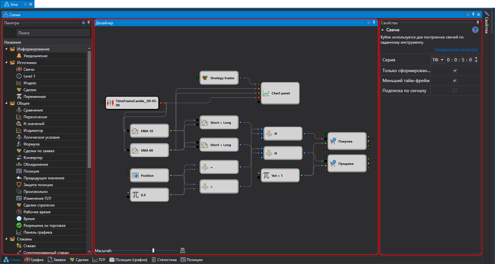
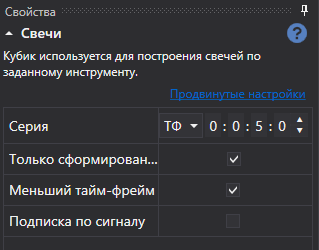

# Дизайнер стратегии

Основной процесс работы по дизайну стратегии и составных элементов проходит в панели **Схема**, путём комбинирования кубиков и соединительных линий. Панель Схема состоит из панелей: **Палитра**, **Дизайнер**, **Свойства**. 

## Панель Палитра

На панели **Палитра** расположены кубики, из которых создаются стратегии. Все элементы в палитре разделены на категории, которые описаны в разделе [Описание кубиков](Designer_Description_of_elements.md). Для добавления кубика на панель **Дизайнер** достаточно нажать правой кнопкой мыши на требуемый кубик и, не отпуская кнопки, перенести его на панель **Дизайнер**. После чего элемент будет автоматически выделен и его параметры будут показаны в окне для редактирования свойств кубика. 

## Панель Дизайнер

На панели **Дизайнер** происходит весь процесс создания стратегии с помощью комбинирования кубиков и соединений (линий). При этом наглядно представляется схема стратегии. Подробно о создания стратегии описано в пункте [Создание алгоритма из кубиков](Designer_Algorithm_creation_of_elements.md). 

## Панель Свойства

На панели **Свойства** отображаются параметры выбранного кубика на панели **Дизайнер**. При выборе кубика на панели **Дизайнер** рамка вокруг него окрашивается в черный цвет. 

Все кубики содержат набор предопределенных свойств:

- **Название** – название элемента, которое отображается в дизайнере.
- **Уровень логирования** – уровень ведения логов для данного элемента.
- **Параметры** – отображать параметры элемента в элементах более высокого уровня.
- **Сокеты** – отображать сокеты элемента в элементах более высокого уровня.

Подробно о свойствах каждого кубика описано в пункте [Описание кубиков](Designer_Description_of_elements.md).

## См. также

[Описание кубиков](Designer_Description_of_elements.md)
