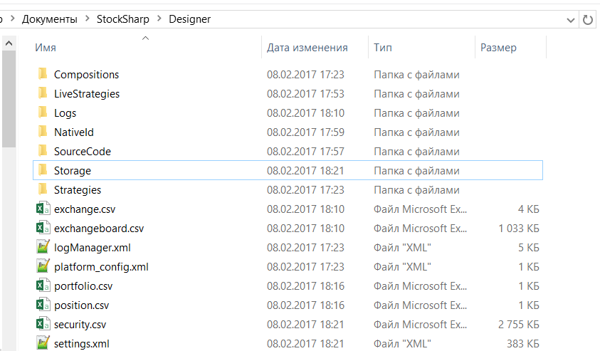

# Редактирование данных вручную

Для работы [Designer](Designer.md) важными являются следующие директории:

1. Директория куда был установлен [Designer](Designer.md), из этой папки можно запустить [Designer](Designer.md) запустив файл **Designer.exe**. Или обновить [Designer](Designer.md), запустив файл **Designer.Update.exe**. Удаление этой директории приведет к удалению [Designer](Designer.md), но настройки [Designer](Designer.md) удалены не будут.

2. Директория настроек **Designer** расположена в документах пользователя в папках …\\StockSharp\\Designer\\ (например, c:\\Users\\ПОЛЬЗОВАТЕЛЬ\\Documents\\StockSharp\\Designer\\). Удаление этой директории приведет к тому, что все настройки [Designer](Designer.md) сбросятся до настроек по умолчанию, **все созданные стратегии и скачанные инструменты и другая информация, хранящаяся в директории настроек, будет УНИЧТОЖЕНА**.

В этой директории расположены следующие паки и файлы:

- Папка **Compositions**, в ней содержатся в виде XML файлов все кубики, которые содержит папка **Составные элементы** панели [Схемы](Designer_Panel_Schemas.md). Удаление файлов из этой директории приведет к удалению **Составного элемента** из папки **Составные элементы** панели [Схемы](Designer_Panel_Schemas.md). Редактировать файлы этой директории вручную не следует, это может привести к неисправности соответствующего кубика **Составные элементы**.
- Папка **LiveStrategies**, в ней содержатся в виде XML файлов все кубики, которые содержит папка **Торговля** панели [Схемы](Designer_Panel_Schemas.md). Удаление файлов из этой директории приведет к удалению стратегии из папки **Торговля** панели [Схемы](Designer_Panel_Schemas.md). Редактировать файлы этой директории вручную не следует, это может привести к неисправности соответствующей стратегии.
- Папка **Logs**, в ней содержатся все аварийные логи [Designer](Designer.md), что упрощает диагностику неисправностей работы [Designer](Designer.md).
- Папка **SourceCode**, в ней содержатся в виде XML файлов все кубики которые содержит папка **Исходный код** панели [Схемы](Designer_Panel_Schemas.md). Удаление файлов из этой директории приведет к удалению кубика **Исходный код** из папки **Исходный код** панели [Схемы](Designer_Panel_Schemas.md). Редактировать файлы этой директории вручную не следует, это может привести к неисправности соответствующего кубика **Исходный код**.
- Папка **Strategies**, в ней содержатся в виде XML файлов все кубики, которые содержит папка **Стратегии** панели [Схемы](Designer_Panel_Schemas.md). Удаление файлов из этой директории приведет к удалению стратегии из папки Стратегии панели Схемы. Редактировать файлы этой директории вручную не следует, это может привести к неисправности соответствующей стратегии. Если вручную добавить файл стратегии в эту папку и перезагрузить [Designer](Designer.md), стратегия появится в папке **Стратегии** панели [Схемы](Designer_Panel_Schemas.md).
- Папка **Storage** \- маркет\-данные, скачанные [Designer](Designer.md) в соответствующее [Хранилище маркет\-данных](Designer_Repository_of_historical_data.md). Папка создается при создании [Хранилище маркет\-данных](Designer_Repository_of_historical_data.md). По умолчанию путь указан в эту папку. Удаление этой папки приведет к удалению всех скачанных маркет\-данных соответствующего хранилища. Если хранилище содержит файлы CSV формата, то они могут быть отредактированы стандартным блокнотом или MS Excel. Файлы BIN вручную редактировать невозможно.
- Файлы **exchange.csv и exchangeboard.csv** содержат список **Бирж**, список кодов инструментов и режимов торгов. Эти файлы могут быть отредактированы стандартным блокнотом или MS Excel.
- Файл **security.csv** содержит все полученные и созданные инструменты по всем источникам. Удаление этого файла приведет к удалению всех инструментов в [Designer](Designer.md). О добавлении новых инструментов описано в пунктах [Скачивание инструментов](Designer_Download_instruments.md), [Создание инструмента](Designer_Creation_tool.md). Этот файл может быть отредактирован стандартным блокнотом или MS Excel.
- Файлы **portfolio.csv и position.csv** содержат все полученные и созданные портфели и текущую позицию по ним. Удаление этих файлов приведёт к удалению соответствующих данных в [Designer](Designer.md). Если информацию о портфелях [Designer](Designer.md) получает при каждом подключении, то информация о позициях может быть утеряна безвозвратно. Эти файлы могут быть отредактированы стандартным блокнотом или MS Excel.
- Файл **settings.json** содержит текущие настройки. Этот файл [Designer](Designer.md) создаёт при изменении настроек или при закрытии программы. Удаление этого файла приведет к сбросу текущих настроек до настроек по умолчанию. Редактировать этот файл вручную не следует, это может привести к неисправности [Designer](Designer.md).

При необходимости редактирования отдельных файлов или сброса настроек [Designer](Designer.md) полезным будет делать резервные копии как отдельных файлов так и всей директории.

## См. также

[Обновление на новую версию](Designer_Update_to_new_version.md)
