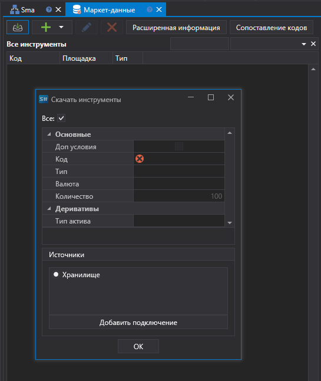

# Скачивание инструментов

При нажатии на кнопку **Скачать инструмент** ![[Designer_Download_instruments_button.png]] появится окно **Скачать инструмент**. Для скачивания инструмента необходимо ввести код инструмента либо установить флаг **Все** и выбрать источник данных затем нажать кнопку **ОК**. [S\#.Designer](Designer.md) начнет поиск инструментов в источнике. Все найденные инструменты добавятся в список инструментов панели **Все инструменты**. Если источником выбрать хранилище и в хранилище уже есть скачанные инструменты, то [S\#.Designer](Designer.md) найдет все имеющиеся инструменты в хранилище. Это может быть полезно, когда история по инструменту уже скачана и скопирована в папку хранилища. По умолчанию [S\#.Designer](Designer.md) использует собственное хранилище, поэтому если вы сохраняли данные в другую папку обращайте внимание на путь к хранилищу и формат данных в нем (bin или csv).

Если нажать на кнопку **Добавить подключение** появится окно [Настройки подключения](Designer_Connection_settings.md).

## См. также

[Создание инструмента](Designer_Creation_tool.md)
