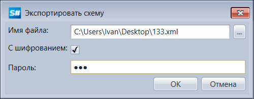
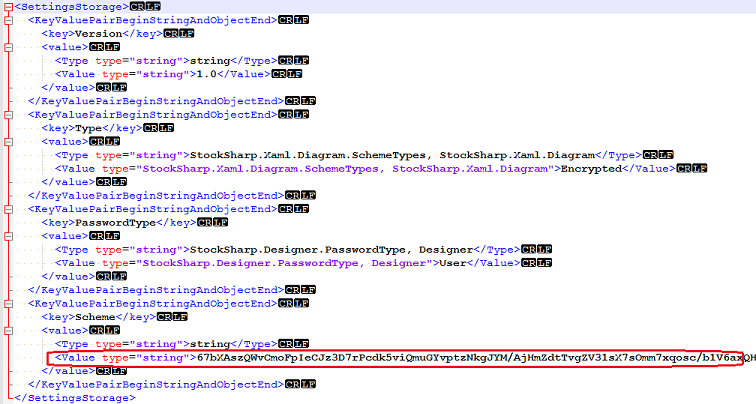

# Экспорт стратегий с шифрованием

В окне **Экспортировать схему** ([Экспорт стратегий](Designer_Export_strategies.md)), есть возможность установить шифрование.

Если после шифрования открыть xml файл, то видно, что описание схемы не читаемо:

При импорте зашифрованного файла, необходимо ввести пароль, который был введен при зашифровке файла.

## См. также

[Импорт стратегий](Designer_Import_strategies.md)
