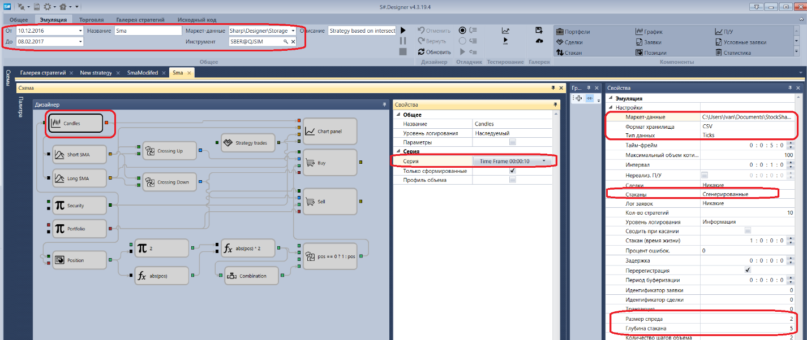
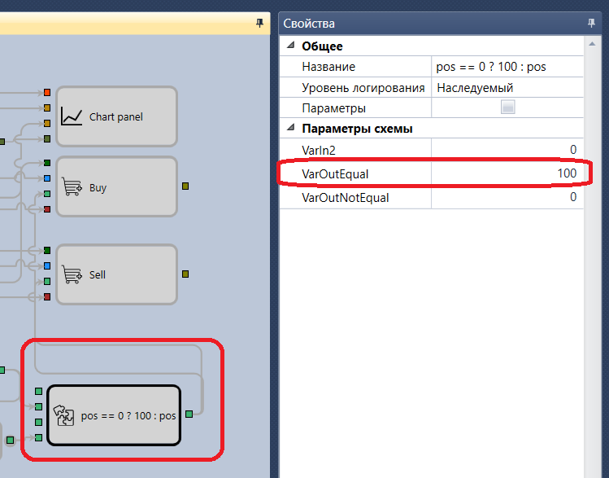
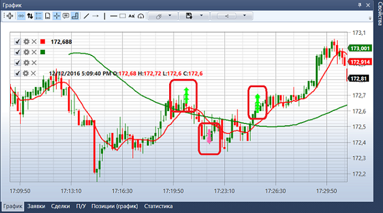
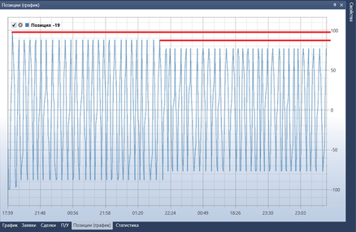
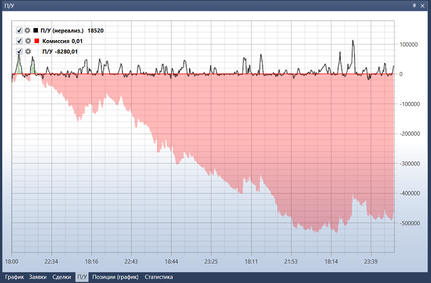

# Пример тестирования на истории

В качестве примера будет рассмотрена пример\-стратегия SMA.

Для запуска тестирования на истории необходимо выбрать стратегию, схема которой будет тестироваться на истории. Стратегия выбирается на панели [Схемы](Designer_Panel_Schemas.md) в папке стратегии, двойным нажатием на интересующей стратегии.

Перед тестированием необходимо загрузить маркет\-данные (инструменты, свечи, тиковые сделки и\/или стаканы). Как это сделать написано в пункте [Хранилище маркет\-данных](Designer_Repository_of_historical_data.md).

При переходе на вкладку со стратегией в ленте автоматически откроется вкладка **Эмуляция**. На ней необходимо установить период тестирования. В поле маркет\-данные указать нужное хранилище ([Хранилище маркет\-данных](Designer_Repository_of_historical_data.md)), в поле инструмент указываем необходимый инструмент.

В примере со стратегией SMA будут использоваться следующие параметры:

1. Инструмент SBER@TQBR
2. Стандартное хранилище \\Documents\\StockSharp\\Designer\\Storage
3. Формат хранилища CSV
4. Тип данных, которые будем брать из хранилища Ticks
5. Стакан Сгенерированный
6. Глубина стакана 5
7. Размер спреда 2
8. Свечи с тайм\-фреймом 30 секунд
9. Объем 100

Необходимо установить выбранные параметры:

После установки всех необходимых параметров, запускаем тестирование стратегии, нажав кнопку . 

Во время или после тестирования можно рассмотреть графики и таблицы с информацией о тестировании.

На графике видно, что сделки проходят на пересечении скользящих средних, как и задумано стратегией. Также видно, что заявки удовлетворяются за несколько сделок. Это происходит из\-за того, что используется сгенерированный стакан, что увеличивает реалистичность тестирования. То, что заявки удовлетворяются за несколько сделок, видно и из таблиц Сделки, Статистика, графика Позиции.

На графике **Позиции** видно, что у стратегии уменьшился оперируемый объём. Это произошло потому, что генерируемый стакан имеет глубину 5 и вследствие чего всей глубины стакана не хватало, чтобы удовлетворить заявку в 200 лотов. А так как стратегия только переворачивает позицию, то каждый раз, когда глубины стакана не хватало удовлетворить заявку, оперируемый объём уменьшался.

График **П\/У** говорит об убыточности стратегии при таких параметрах.

## См. также

[Live торговля](Designer_Live_trade.md)
