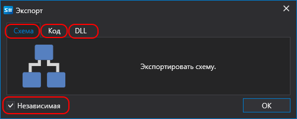
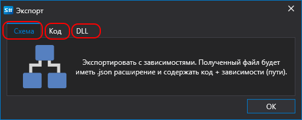

# Экспорт

Дизайнер позволяет экспортировать любой тип данных: стратегии, кубики и индикаторы. Для экспорта есть следующие способы:

- В панели **Схемы** нажать правую кнопку мыши на стратегии, кубике или индикаторе. В появившемся меню выбрать **Экспорт**.
- На вкладке **Общее** нажать кнопку **Экспорт**:

После нажатия **Экспорт** в зависимости от типа контента появится окно:

- для [схемы](Designer_Creating_strategy_out_of_blocks.md):

  

  - схема - экспортировать схему как есть. Режим **Независимая** необходим для схем, которые используют собственные кубики или индикаторы. В этом случае все составные элементы будет экспортирована внутри схемы стратегии.
  - код - преобразовать схему в код C#.
  - DLL - скомпилировать схему в DLL. Подойдет в том случае, если необходимо сохранить код в секрете.

- для [кода](Designer_Creating_strategy_from_code.md):

  

  - схема - экспортировать код ввиде JSON файла, где будет прописан как сам код, так и ссылки, необходимые для компилирования данного кода.
  - код - экспортировать код как есть.
  - DLL - скомпилировать код в DLL. Подойдет в том случае, если необходимо сохранить код в секрете.

- для [dll](Designer_Creating_strategy_from_dll.md) появится окно выбора файла.

## См. также

[Запуск стратегий вне Дизайнера](Designer_run_strategy_on_server.md)
