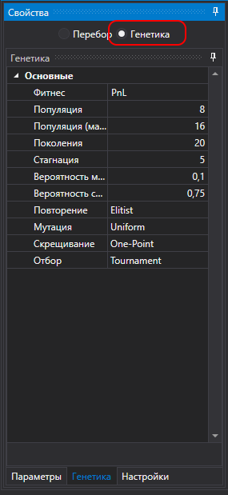
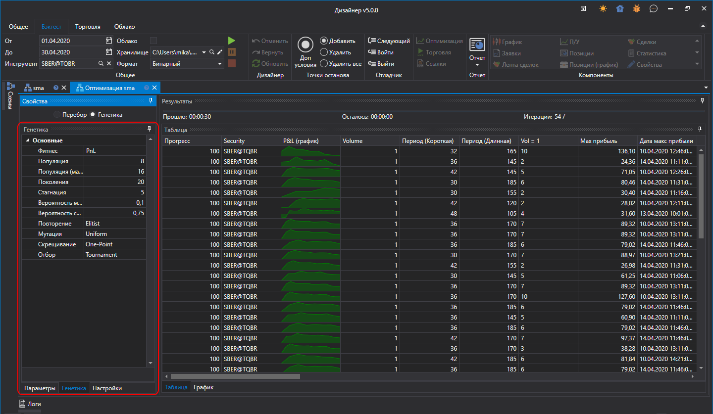
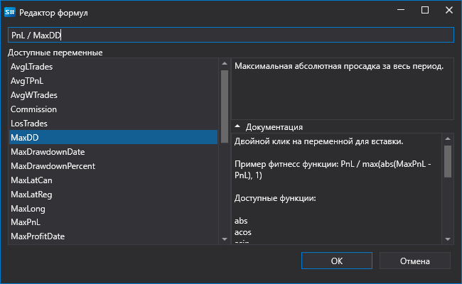

# Генетика

**Дизайнер** поддерживает как оптимизацию [методом перебора](Designer_Optimization.md), так и на основе генетических алгоритмов. Генетическая оптмизимация позволяет значительно ускорить процесс поиска оптимальных параметров.

Чтобы включить **Генетическую** оптимизацию, необходимо:

- переключить режим:

  

- задать параметры оптимизации:

  

- в качестве целевой функции (Фитнес) можно указать расширенную формулу:

  

  Например, сделать расчет не только по **Прибыли**, но так же относительно ее к **Максимальной Просадке**. Доступные математические функции аналогичны кубику [Формула](Designer_Universal_formula.md).

> [!TIP]
> Оптимизация через генетику не детерминирована. Поэтому определение точного количества итераций и, как следствие, необходимого общего времени - невозмжожно в отличие от [перебора через брут-форс](Designer_Optimization.md).