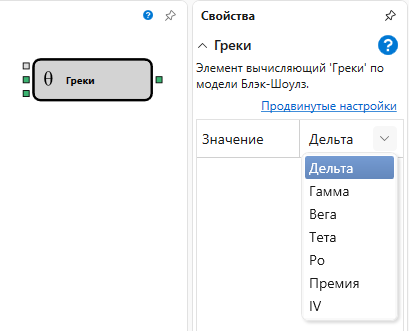

# Греки

Кубик используется для расчета основных "греков": Дельта, Гамма, Вега, Тета, Ро в текущий момент времени.

### Входящие сокеты

Входящие сокеты

- **Модель** – модель расчета (например, Блэк-Шоулз).
- **Цена базового актива** – цена базового актива.
- **Максимальное отклонение** – максимальное отклонение.

### Исходящие сокеты

Исходящие сокеты

- **Результат** – результат расчета основных "греков": Дельта, Гамма, Вега, Тета, Ро в текущий момент времени.

### Параметры

Параметры

- **Значение** – может принимать тип "грека" Дельта, Гамма, Вега, Тета, Ро и определяет какое значение будет на выходе кубика.

## См. также

[Хеджирование](Designer_Black_Scholes.md)