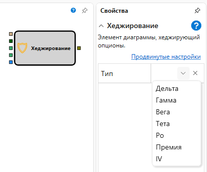

# Хеджирование

Кубик используется для хеджирования позиций по опционам.

### Входящие сокеты

Входящие сокеты

- **Модель** – модель расчета (например, Блэк-Шоулз).
- **Инструмент** – инструмент, базовый актив.
- **Объем** – числовое значение объема.
- **Позиция по базовому активу** – позиция по базовому активу.
- **Флаг** – сигнал (флаг), который инициирует процесс хеджирования.

### Исходящие сокеты

Исходящие сокеты

- **Заявка** – выставленная заявка, которая может использоваться для получения сделок по ней с помощью элемента **Сделки** по заявке и отображения на графике с помощью кубика **Панель графика**

### Параметры

Параметры

- **Тип хеджирования** \- тип хеджирования, может принимать значения Дельта, Гамма, Вега, Тета, Ро.

## См. также

[Котирование](Designer_Quoting.md)
