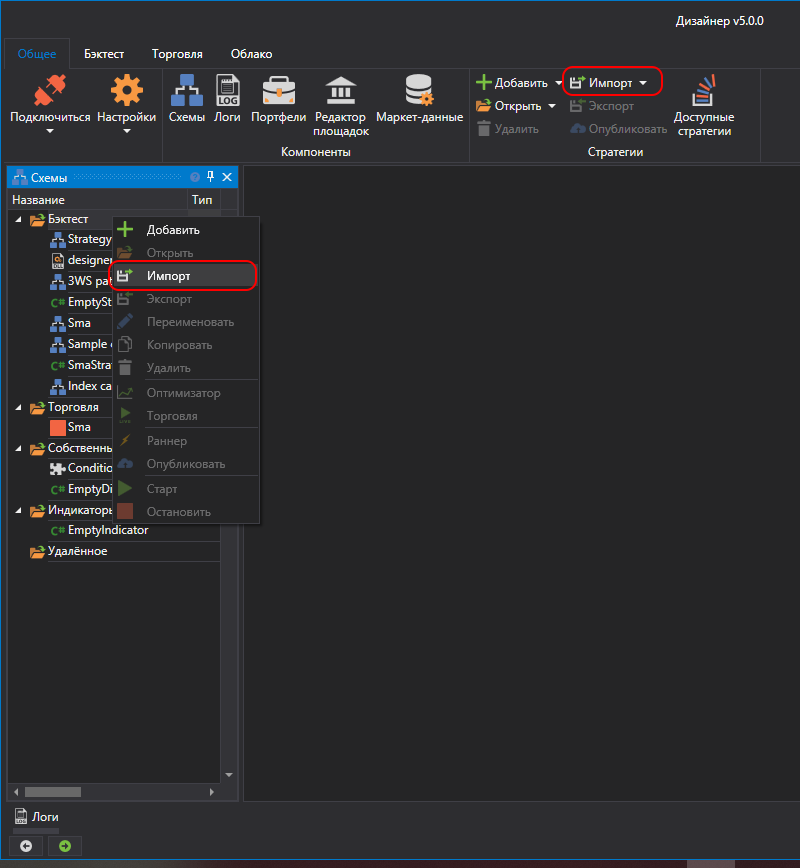
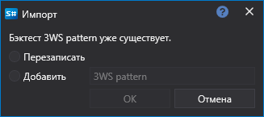

# Импорт

Дизайнер позволяет импортировать любой тип данных: стратегии, кубики и индикаторы. Для импорта есть следующие способы:

- В панели **Схемы** нажать на правую кнопку мыши на папке стратегии, в появившемся меню выбрать **Импорт**.
- На вкладке **Общее** нажать кнопку **Импорт** в появившемся меню выбрать **Стратегия**, **Собственный кубик** или **Индикатор**:

Если тип данных с этим именем есть, то появится окно с предложением перезаписать, добавить с другим названием:

## См. также

[Интерфейс](Designer_Backtesting_Interface.md)
