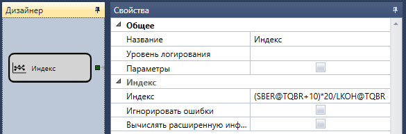

# Индекс

Кубик используется для создания собственного индекса. 

### Исходящие сокеты

Исходящие сокеты

- **Инструмент** – вычисленный индекс, представленный как **Инструмент**.

### Параметры

Параметры

- **Индекс** – математическая формула комбинации нескольких инструментов (например, (SBER@TQBR+10)\*(abs(20\/LKOH@TQBR)).
- **Игнорировать ошибки** – установленный флаг обозначает, что при расчете индекса будут игнорироваться ошибки;
- **Вычислять расширенную информацию** \- установленный флаг обозначает, что при расчете индекса помимо основной информации (Общий объем, Цена открытия, Цена закрытия, Цена наивысшая, Цена наименьшая) будет вычисляться расширенная информация (Суммарный оборот по сделкам, Объем открытия, Объем закрытия, Максимальный объем, Минимальный объем);

Доступные математические формулы аналогичны кубику [Формула](Designer_Universal_formula.md).

## См. также

[Переменная](Designer_Variable.md)
