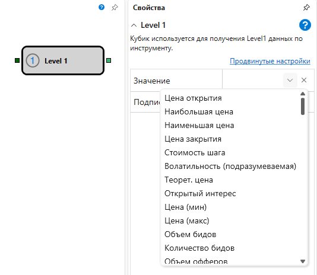

# Level 1

Кубик используется для получения **Level1** данных по инструменту. 

### Входящие сокеты

Входящие сокеты

- **Инструмент** – инструмент, для которого необходимо получать **Level1** данные.

### Исходящие сокеты

Исходящие сокеты

- **Изменение** – **Level1** значения отслеживаемого параметра.

### Параметры

Параметры

- **Значение** – **Level1** параметр, который необходимо отслеживать.
- **Подписка по сигналу** – подписаться на данные только после прихода триггера.

## См. также

[Индекс](Designer_Ticks.md)
