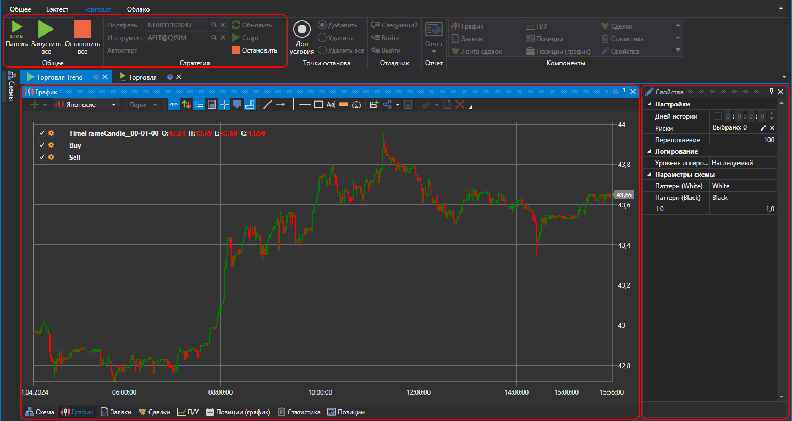

# Интерфейс

После добавления стратегии в папку **Торговля**, выбрав двойным нажатием добавленную стратегию откроется вкладка с названием «Торговля Имя стратегии». При переходе на которую в **Ленте** автоматически откроется вкладка **Торговля**. На вкладке **Торговля** можно указать инструмент и портфель, с которыми с которыми будет работать стратегия. Нажав кнопку **Старт** \- запустить стратегию Live торговлю, нажав кнопку **Стоп** \- остановить. 

Вкладка стратегии содержит Дизайнер схем стратегии и составных элементов, аналогичный описанному в пункте [Дизайнер стратегии](Designer_Designer_schemes_strategies_and_component_elements.md). Но в случае с Live торговлей нельзя перемещать, добавлять или удалять кубики и соединения. Также вкладка содержит панель [Свойства Live торговли](Designer_Properties_Live.md), по умолчанию эта панель свернута и прикреплена к правой части вкладки.

При первом запуске у всех стратегий установлен режим прогрева, о чем сообщает строка над схемой стратегии. В режиме прогрева выставление заявок отключено. Для выхода из режима прогрева необходимо нажать кнопку **Торговля**. 

## См. также

[Настройки подключения](Designer_Connection_settings.md)
