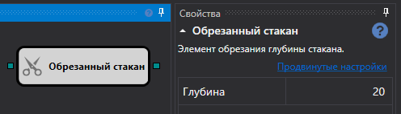

# Обрезанный стакан

Кубик используется для получения обрезанного стакана на заданную глубину.

### Входящие сокеты

Входящие сокеты

- **Стакан** – стакан, который надо обрезать.

### Исходящие сокеты

Исходящие сокеты

- **Стакан** – обрезанный стакан.

## См. также

[Стакан подразумеваемой волатильности](Designer_Depth_implied_volatility.md)
