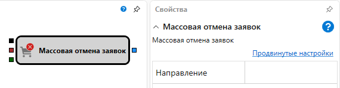

# Массовая отмена заявок

Кубик используется для отмены всех заявки по инструменту.

#### Входящие сокеты

Входящие сокеты

- **Портфель** – портфель, для которого надо отменить все заявки.
- **Инструмент** – инструмент, для которого надо отменить все заявки.
- **Направление** – направление отменяемых заявок (покупка или продажа), является сигналом отмены заявки.

## См. также

[Регистрация заявки](Designer_Position_opening.md)
