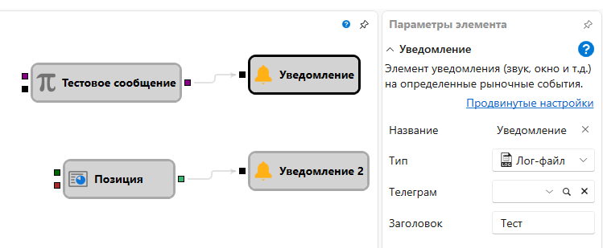

# Уведомление

Кубик используется для уведомления пользователя при возникновении определенных сигналов. 

### Входящие сокеты

Входящие сокеты

- **Флаг** – сигнал (флаг), который инициирует процесс оповещения.

### Параметры

Параметры

- **Тип** – тип сообщения (всплывающее окно, e\-mail, смс и т.д.). Типы оповещений описаны в пункте [Настройки уведомлений](Terminal_Notifications.md).
- **Заголовок** – заголовок сообщения.
- **Сообщение** – текст сообщения.

## См. также

[Настройки уведомлений](Terminal_Notifications.md)
