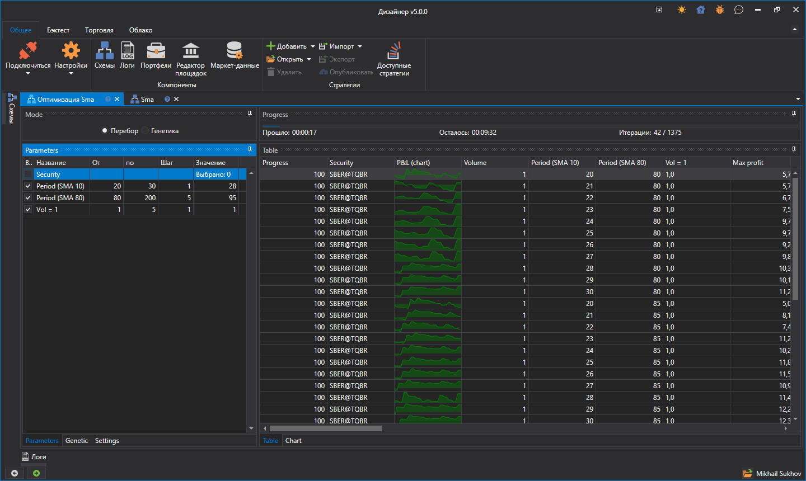

# Перебор (брут-форс)

Чтобы перейти в режим оптимизации стратегии необходимо нажать на ккнопку **Оптимизация** на вкладке **Эмуляция**. Пример оптимизации будет рассмотрена на примере стратегии SMA, созданной [из кубиков](Designer_Algorithm_creation_of_elements.md).

В рабочей области откроется вкладка с названием Оптимизация + «Имя стратегии». Вкладка **Оптимизация** разделена на две зоны, **Свойства**, **Результат оптимизации**: 

- Зона **Свойства** представляет из себя закладки с несколькими таблицами. Первая - это параметры стратегии, по которым [происходит перебор](Designer_Optimization_Params.md). Вторая - настройки [генетики](Designer_Genetic.md). Третья - системные настройки оптимизатора. Например, там можно менять количество потоков и ядер, участвующих в оптимизации.
- Зона **Результат оптимизации** представляет из себя таблицу, каждая строчка которой результат тестирования стратегии с уникальными параметрами. Также в зоне **Результат оптимизации** есть прогресс бар, показывающий прогресс оптимизации, прошедшее время, и расчетное время до конца оптимизации. Дополнительно присутствует закладка для отображения результатов ввиде [3D графика](Designer_Optimization_3D_Chart.md).

Задав параметры для перебора, итогово получается больше 1000 итераций. После запуска оптимизатора вверху над результатами будет показан прогресс с данными о том, сколько планируется итераций, сколько их уже выполнено и сколько примерно времени требуется до полного окончания:

## См. также

[Пример тестирования на истории](Designer_Example_of_backtesting.md)
