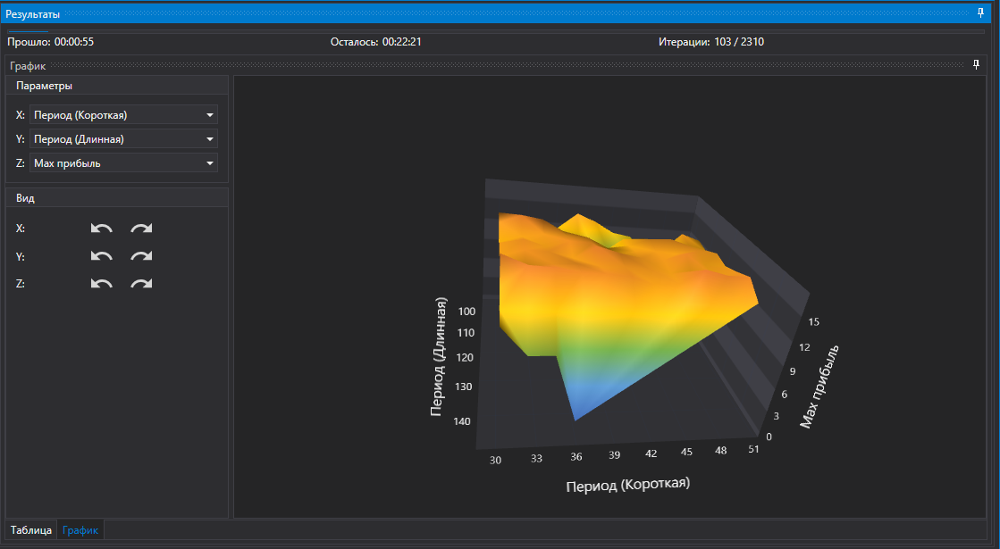

# 3D отчет

Результаты оптимизации можно просматривать ввиде 3D графика. Для этого в панели результатов необходимо переключить закладку на График:

График умеет показывать в 3-ех мерной проекции, а значит размерности возможность только 3. Поэтому, если оптимизация идет по 4 и более параметрам, то для просмотра результат необходимо менять размерности по X и Y.

Размерность по Z должна быть всегда числовой, в отличие от X и Y, где размерности могут быть, например, по [инструментам](Designer_Portfolio_Testing.md).