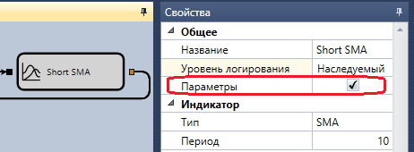

# Параметры оптимизации

Оптимизация производится по параметрам стратегии, имеющие следующий тип:

- числовые (целочисленные и дробные)
- время ([TimeSpan](xref:System.TimeSpan))
- булевое значение (Истина-Ложь)
- [Unit](Unit.md) значение

По-умолчанию все параметры с этими типами будут представлены в таблице [параметров оптимизатора](Designer_Optimization.md). В случае, если необходимо отключить какой-то параметр из оптимизации, то:

- в случае [схемы](Designer_Creating_strategy_out_of_blocks.md) необходимо выбрать нужный кубик, открыть его свойство, переключиться на **Расширенные настройки** и выключить флажок **Параметр**:



- в случае [кода](Designer_Creating_strategy_from_code.md) необходимо прописать код при определении параметра, и изменить свойство [CanOptimize](xref:StockSharp.Algo.Strategies.IStrategyParam.CanOptimize):

```cs
_long = this.Param(nameof(Long), 80);
_short = this.Param(nameof(Short), 20);
			
// turn off param for optimization
_long.CanOptimize = false;
```

После изменения доступных параметров оптимизации необхоимо переоткрыть [панель с оптимизацией](Designer_Optimization.md).