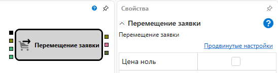

# Перемещение заявки

Кубик используется для изменения заявки по инструменту.

#### Входящие сокеты

Входящие сокеты

- **Заявка** – заявка, которая будет изменена.
- **Цена** – числовое значение новой цены.
- **Объем** – числовое значение нового объема.

#### Исходящие сокеты

Исходящие сокеты

- **Заявка** – измененная заявка, которая может использоваться для получения сделок по ней с помощью элемента **Сделки** по заявке и отображения на графике с помощью кубика **Панель графика**

## См. также

[Сделки по заявке](Designer_Deals_on_request.md)
