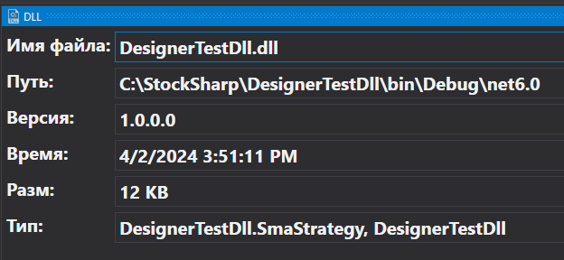

# Панель DLL

Панель DLL показывать мета-информацию .NET сборки:

В панели можно увидеть время создания файла, его версию и путь. По времени создания проще всего определить, какая версия сборки используется **Дизайнером**.

При перекомпиляции сборки через [стороннюю программу](Designer_Creating_DLL_element_in_Visual_Studio.md) мета-данные будут автоматически обновлены.