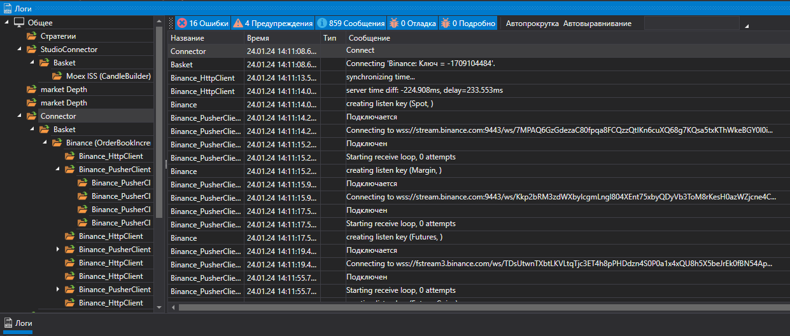

# Панель Логи

Для упрощения мониторинга работы в программы существует специальная панель **Логи**. В данную панель выводятся сообщения от всех источников, стратегий, подключений. В панели **Логи** в виде дерева показывается вложенность источников. Каждая родительская вершина содержит сообщения всех вложенных и так далее, до самого нижнего уровня. Для стратегий такая иерархия позволяет увидеть дочерние стратегии. Чтобы открыть панель **Логи** необходимо нажать на кнопку **Логи** во вкладке **Общие** или нажать кнопку **Логи ** на **Панели быстрого доступа**. Если в панели **Логи** появились ошибки на **Панели быстрого доступа** начнет мигать значок  .

## См. также

[Портфели](Designer_Panel_Portfolios.md)
