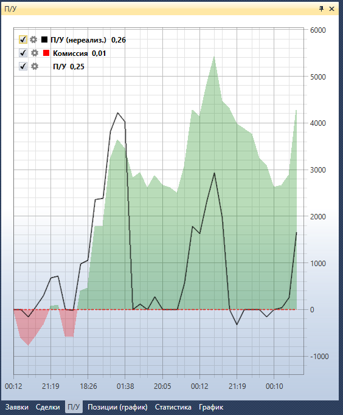

# График П\/У

Компонент **П\/У** представляет собой график Прибыли\/Убытка (не реализованной), Прибыли\/Убытка (реализованной) и комиссии. В левом верхнем углу графика показаны все графические элементы, добавленные на график, если убрать флажок  на графическом элементе уберется и элемент с графика. Нажав на кнопку  откроются настройки графического элемента. 

## См. также

[Пример Live торговли](Designer_Example_of_Live_trading.md)
