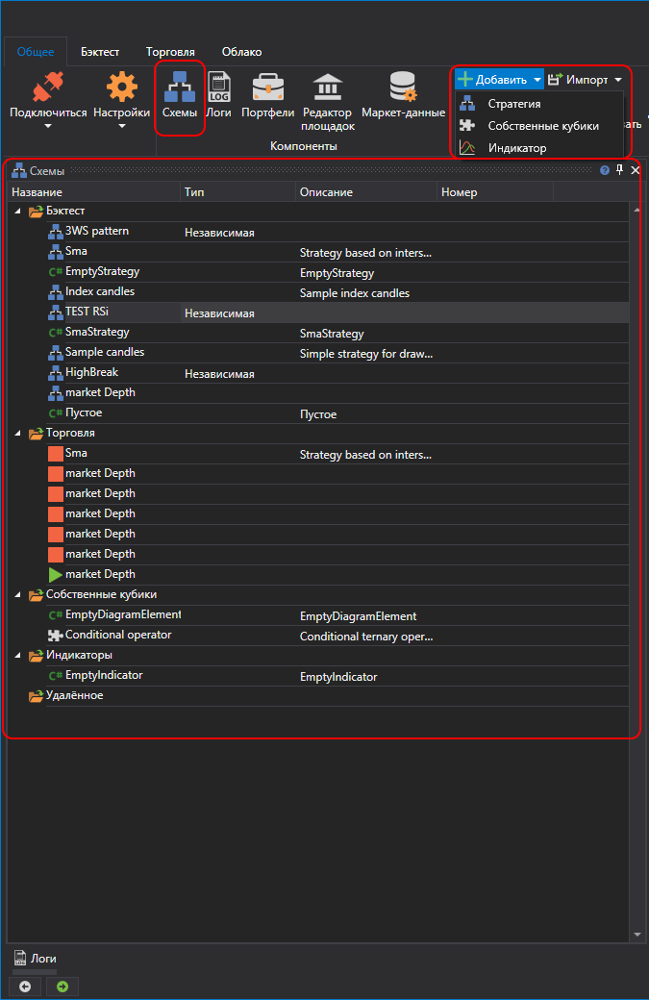
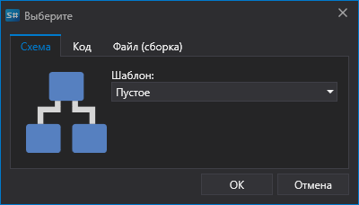

# Панель Схемы

Чтобы открыть панель **Схемы** необходимо нажать на кнопку **Схемы** во вкладке **Общее**. Панель **Схемы** содержит дерево скриптов, сгруппированных в папки по назначению. Схемы стратегий и собственных кубиков ничем не отличаются. Для их редактирования используется один общий редактор [Дизайнер стратегий](Designer_Designer_schemes_strategies_and_component_elements.md). Но, чтобы не возникало путаницы между ними, они разделены на две независимых списка и хранятся в различных папках (стратегии в папке **Бэктест**, собственные кубики в папке **Собственные кубики**). Выбор схемы для редактирования осуществляется двойным кликом мышки по нужному элементу в списке. При этом выбранная схема откроется в дизайнере для просмотра и редактирования. Ниже приведено описание папок панели **Схемы**:

1.  Папка **Бэктест** содержит торговые стратегии, созданные как в виде схем из набора элементов и связей между ними, называемых соединениями, так и из кода. Добавить новую стратегию можно нажав на кнопку **Добавить**  во вкладке **Общее** и выбрать **Стратегия**. Или нажав правой кнопкой мыши на папке **Бэктест** панели **Схемы**, и нажать на кнопку **Добавить**  в выпавшем меню. В открывшемся окне с помощью соответствующей вкладки выбираем как именно мы хотим создавать стратегию
   
    
   
    Стратегию можно создавать с помощью визуального конструктора без кодирования или с помощью встроенного редактора исходного кода. Помимо этого, возможно подключение внешних файлов dll со стратегиями, написанными в среде Microsoft Visual Studio. Подробно о **Стратегиях** описано в пункте [Использование кубиков](Designer_Creating_strategy_out_of_blocks.md). 

2. Папка **Собственные кубики** содержит элементы, которые представляют собой законченный функционал и могут быть использованы в различных схемах или одной схеме множество раз с различными значениями свойств. Подобные наборы элементов можно вынести в отдельный кубик, который дальше будет использоваться как любой обычный элемент. **Собственный кубик** представляет собой обычную схему, которая сохраняется\/загружается\/редактируется как любая схема стратегии. Добавить новый составной элемент можно нажав на кнопку **Добавить**  во вкладке **Общее** и выбрать **Собственные кубики**. Или нажав правой кнопкой мыши на папке **Собственные кубики** панели **Схемы**, и нажать на кнопку **Добавить**  в выпавшем меню. При добавлении новых собственных кубиков, они автоматически добавляются в **Палитру элементов**, в группу **Собственные кубики** и могут использоваться при создании других схем стратегий и собственных кубиков. Подробно о **Собственных кубиках** описано в пункте [Создание собственных кубиков](Designer_Creating_composite_elements.md). 

3. Папка **Торговля** содержит стратегии, которые добавлены для запуска в торговлю. При этом стратегии, которые запущены отмечены значком  , а которые остановлены \- отмечены значком  . Как добавлять стратегии в папку **Торговля** и как их запустить описано в пункте [Live торговля](Designer_Add_strategy_Live_trade.md).

4. Папка **Индикаторы** содержит ваши собственные индикаторы для торговых стратегий, написанные вами самостоятельно. Новые индикаторы невозможно создать с помощью схем, доступны только код и внешние файлы dll. Использование собственных индикаторов в схемах доступно через кубик [Индикатор](Designer_indicator.md) при выборе типа индикатора. с

5. Папка **Удаленное** содержит стратегии находящиеся на удаленном сервере.
## См. также

[Панель Логи](Designer_Panel_Logs.md)
