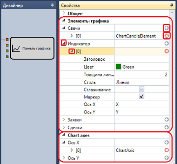
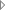
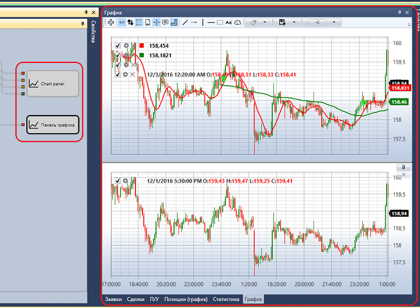

# Панель графика

Кубик предназначен для отображения данных на графике в панели [График](Designer_Chart.md). Каждый элемент соответствует одной области на графике и содержит набор свойств, с помощью которых можно определить набор осей на графике, набор графических элементов и параметры их отображения. Добавление любого графического элемента происходит нажатием на кнопку  удаление нажатием на кнопку . При добавлении графического элемента (серия свечей, индикатор, сделки и др.) в настройках, у кубика создается специальный входной параметр, через который данные для отображения будут передаваться в этот кубик, и в следствии чего будут отображаться на панели [График](Designer_Chart.md). При нажатии на кнопку  будут открываться дочерние графические элементы или их настройки.

На панели [График](Designer_Chart.md) отображается все полученные данные в кубики **Панель графика**. Для разных серий свечей стоит заводить разные кубики **Панель графика**. При этом графики будут располагаться друг над другом, но на каждом будут отображены только соответствующие ему графические элементы (серия свечей, индикатор, сделки и др.). В примере видно, что на верхнем графике отображены свечи, 2 индикатора, и сделки, что соответствует 4 входным параметрам верхнего кубика. На нижнем отображены только свечи. Более подробно о панели [График](Designer_Chart.md) можно узнать в пункте [График](Designer_Chart.md).

## См. также

[Рабочее время](Designer_Working_time.md)
