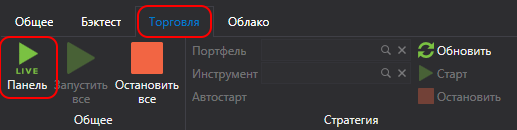
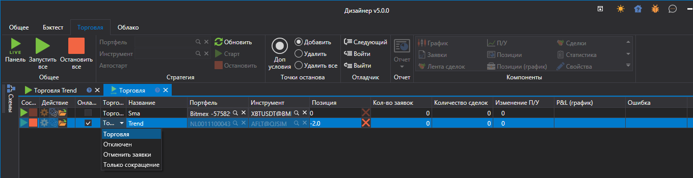

# Панель стратегий

При нажатии на вкладке **Общая** на кнопку **Торговля**  откроется панель **Торговля**.

Панель **Торговля** представляет из себя таблицу, на которой отображены все стратегии, добавленные в **Live торговлю**. На панели **Торговля** можно посмотреть текущее состояние стратегии, а также запустить или остановить стратегию кнопками , .

## См. также

[Пример Live торговли](Designer_Example_of_Live_trading.md)
