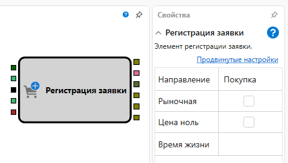
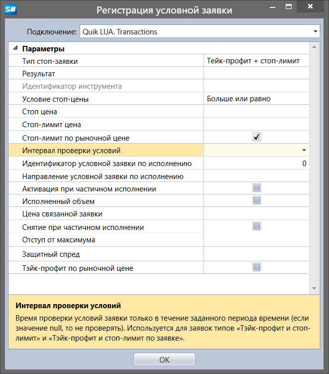

# Регистрация заявки

Кубик используется для регистрации заявки по инструменту.

### Входящие сокеты

Входящие сокеты

- **Инструмент** – инструмент, для которого надо выставить заявку.
- **Направление** – направление заявки (покупка или продажа), является сигналом выставления заявки.
- **Триггер** \- сигнал, с помощью которого определяется момент, когда необходимо выствить заявку.
- **Цена** – числовое значение цены, если выставляется не рыночная заявка.
- **Объем** – числовое значение объема.
- **Портфель** – портфель, для которого надо выставить заявку.

### Исходящие сокеты

Исходящие сокеты

- **Заявка** – выставленная заявка, которая может использоваться для получения сделок по ней с помощью элемента **Сделки** по заявке и отображения на графике с помощью кубика **Панель графика**
- **Заявка\-ошибка** – заявка, не прошедшая регистрацию из\-за ошибки.

### Параметры

Параметры

- **Направление** – направление заявки (покупка или продажа), является сигналом выставления заявки.
- **Рыночная** – признак рыночной заявки.
- **Цена ноль** – Нулевая цена регистрирует рыночную заявку.
- **Код клиента** – код клиента присвоенный брокером, если значение не указано и установлен флажок **Параметры**, то берется значение из стратегии.
- **Брокер** – код брокерской фирмы, если значение не указано и установлен флажок **Параметры**, то берется значение из стратегии.
- **Условная заявка** – добавить условную заявку.
- **Обрезать цену для заявки** – Обрезать цену для заявки.
- **Маржинальность** – Включена ли маржинальность.
- **Маркет\-мейкер** – Является ли заявка маркет\-мейкерской.
- **Ручная** – Является ли заявка ручной.
- **Время жизни** – Время жизни лимитной заявки.
- **Время экспирации заявки** – Время истечения срока действия заявки.
- **Проскальзывание** – Проскальзывание в цене сделки.

## Настройка условной заявки

**Условная заявка** — заявка с дополнительными условиями, определяющими момент постановки в торговую систему в зависимости от текущей рыночной ситуации.

- **Подключение** \- подключение куда будет выставляться заявка.
- **Тип стоп\-заявки** \- тип стоп\-заявки.
- **Результат** \- результат исполнения стоп\-заявки.
- **Идентификатор инструмента** \- идентификатор инструмента для стоп\-заявок с условием по другому инструменту.
- **Условие стоп\-цены** \- условие стоп\-цены. Используется для заявок типа «Стоп\-цена по другой бумаге».
- **Стоп цена** \- стоп цена, которая задает условие срабатывания стоп\-заявки.
- **Стоп\-лимит цена** \- стоп\-лимит цена. Аналогична Стоп\-цене, но используется только при типе заявки «Тэйк\-профит и стоп\-лимит».
- **Стоп\-лимит по рыночной цене** \- признак исполнения заявки «Стоп\-лимит» по рыночной цене.
- **Интервал проверки условий** \- время проверки условий заявки только в течение заданного периода времени (если значение null, то не проверять). Используется для заявок типов «Тэйк\-профит и стоп\-лимит» и «Тэйк\-профит и стоп\-лимит по заявке».
- **Идентификатор условной заявки по исполнению** \- идентификатор условной заявки по исполнению.
- **Направление условной заявки по исполнению** \- направление условной заявки по исполнению.
- **Активация при частичном исполнении** \- частичное исполнение заявки учитывается. Заявка «по исполнению» будет активирована при частичном исполнении заявки\-условия.
- **Исполненный объем** \- брать исполненный объем заявки в качестве количества выставляемой стоп\-заявки. В качестве количества бумаг в заявке «по исполнению» принимается исполненный объем заявки\-условия.
- **Цена связанной заявки** \- цена связанной лимитированной заявки.
- **Снятие при частичном исполнении** \- признак снятия стоп\-заявки при частичном исполнении связанной лимитированной заявки.
- **Отступ от максимума** \- величина отступа от максимума (минимума) цены последней сделки.
- **Защитный спред** \- величина защитного спрэда.
- **Тэйк\-профит по рыночной цене** \- признак исполнения заявки «Тэйк\-профит» по рыночной цене.

## См. также

[Перемещение заявки](Designer_Orders_Moving.md)
