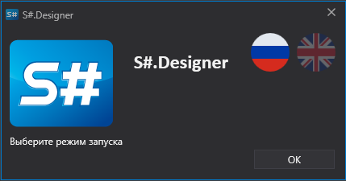
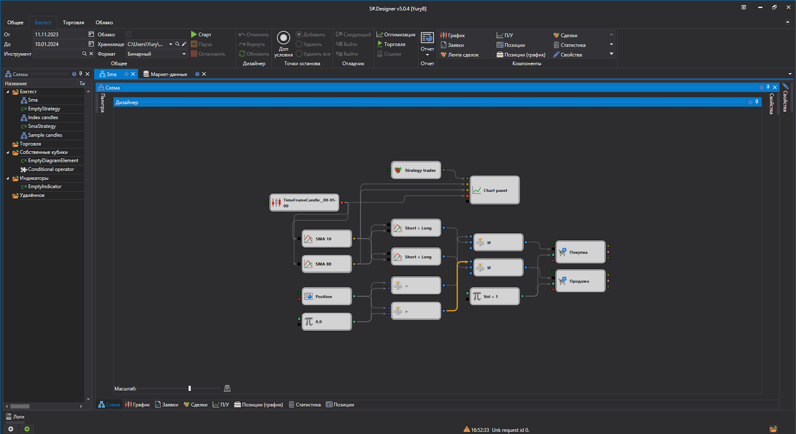
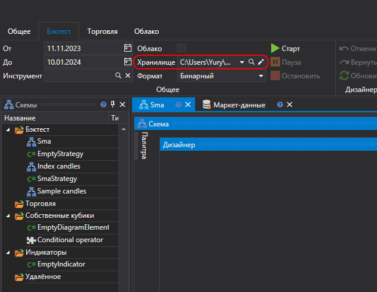
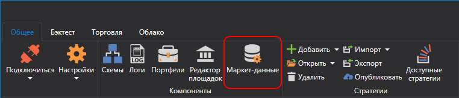
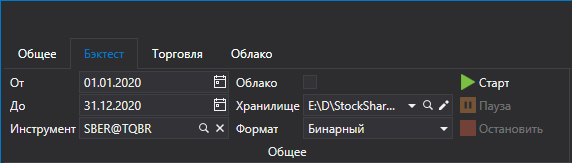
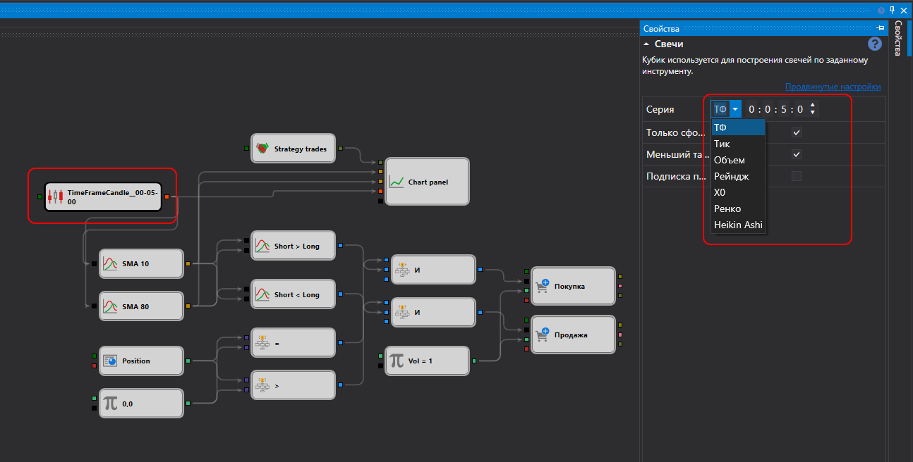
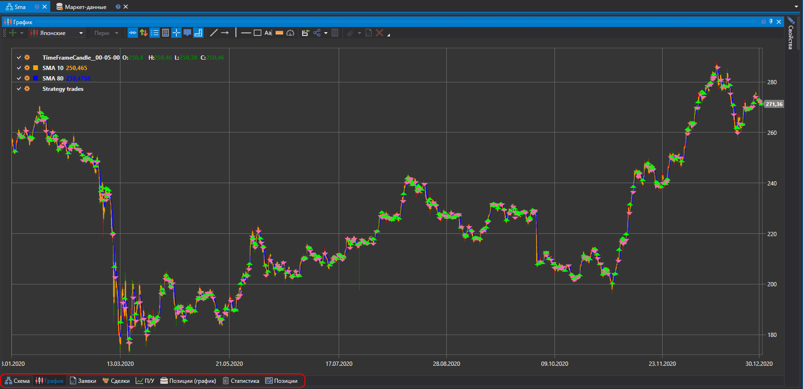

# Быстрый запуск

При первом запуске [Designer](Designer.md) будет показано следующее окно:

Необходимо выбрать режим запуска и нажать кнопку **ОК**.

При первом запуске [Designer](Designer.md) откроет предустановленную схему стратегии скользящей средней. 

Для того, чтобы запустить ее на исторических данных потребуется их скачать в правильном формате. Мы рекомендуем воспользоваться программой [Hydra](Hydra.md) (кодовое название Hydra) предназначенной для автоматической загрузки маркет\-данных (инструменты, свечи, тиковые сделки и стаканы и др.) из различных источников и хранения их в локальном хранилище. О скачивании и хранении исторических данных подробно описано в пункте [Хранилище маркет\-данных](Designer_Repository_of_historical_data.md).

После того, как данные скачаны с помощью [Hydra](Hydra.md), необходимо указать [Designer](Designer.md) директорию в которой они были сохранены. Подобная настройка выполняется на вкладке **Бэктест** -> **Хранилище**. 

При нажатии на кнопку  появится окно **Параметры хранилища данных**, позволяющее настроить как локальное, так и удаленное хранилище. Также возможна настройка подключения  [Hydra](Hydra.md) [в серверном режиме](HydraSettings.md), как источника маркет-данных. При нажатии на кнопку ![[Designer_Settings_Repository_button.png]] открывается окно выбора папки. В нем необходимо выбрать ту в которую ранее вы сохранили скачанную  [Hydra](Hydra.md) историю.
Теперь нужно получить инструменты и данные по ним из настроенного локального хранилища. Для этого переходим на вкладку **Общее** и выбираем компонент **Маркет-данные**

Откроется вкладка управления маркет-данными из которой осуществляется работа с инструментами. Для получения доступных инструментов необходимо нажать на кнопку 
([Скачивание инструментов](Designer_Download_instruments.md)). Для скачивания инструмента необходимо ввести код инструмента либо установить флаг **Все**, выбрать источник данных и нажать кнопку **ОК**. [Designer](Designer.md) запросит у источника данных имеющиеся у него инструменты. Все найденные инструменты появятся в панели **Все инструменты**. 

Теперь [Designer](Designer.md) может использовать загруженные инструменты и имеющиеся в хранилище исторические данные. Выберем одну из демонстрационных стратегий. На панели [Схемы](Designer_Panel_Schemas.md) в папке **Стратегии** двойным нажатием выбираем пример\-стратегию **SMA**, после чего в рабочей области появится вкладка **Sma**. После перехода на стратегию в ленте  автоматически откроется вкладка **Бэктест**, на которой расположены основные элементы по созданию стратегии, отладке, тестированию стратегий ([Создание стратегии](Designer_Creation_strategy.md), [Пример тестирования на истории](Designer_Example_of_backtesting.md))

На вкладке **Бэктест** необходимо установить период тестирования, выбрать инструмент и [Хранилище маркет\-данных](Designer_Repository_of_historical_data.md).

Нажав на значок  в поле **Инструмент** откроется окно **Выбор инструмента**. В этом окне необходимо выбрать требуемый инструмент.

Выбрав любой блок на панели **Дизайнер**, в панели **Свойства** появятся свойства этого блока. В панели **Свойства** блока **Candles** можно настроить тип и Time Frame свечей ([Свечи](Candles.md)).

После нажатия кнопку **Старт** начнется эмуляция торгов. Результаты тестирования можно увидеть на соответствующих вкладках схемы: График, Заявки, Сделки, П/У, Позиции (график), Статистика, Позиции.

