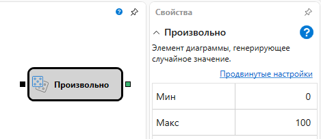
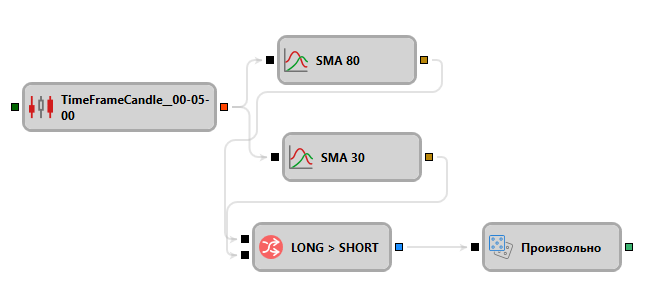

# Произвольное значение

Кубик используется для генерации произвольного (рандомного) значения.

#### Входящие сокеты

Входящие сокеты

- **Триггер** – сигнал, с помощью которого определяется момент, когда необходимо передать сгенерировать произвольное значение через выходной сокет.

### Исходящие сокеты

Исходящие сокеты

- **Значение** – произвольное значение.

### Параметры

Параметры

- **Мин** - минимально допустимая граница значения.
- **Макс** - максимально допустимая граница значения.

## См. также

[Изменение П/У](Designer_StrategyPnLDiagramElement.md)
