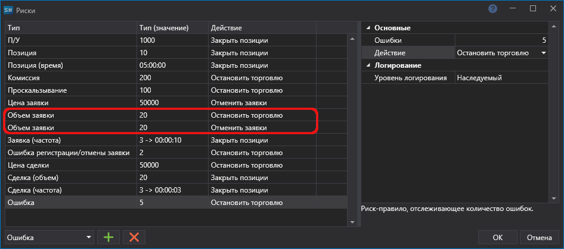

# Риск\-менеджмент

На панелях [Свойства тестирования](Designer_Properties_emulation.md) и [Свойства Live торговли](Designer_Properties_Live.md) можно установить настройки контроля рисков.

В окне Риски необходимо выбрать **Риск\-правило**, настроить условие срабатывания **Риск\-правила** и действие (Закрыть позиции, Остановить торговлю, Отменить заявки), которое будет выполняться при наступлении условия **Риск\-правил**.

### Список Риск\-правил

Список Риск\-правил

- **Заявка (объем) ** \- риск\-правило, отслеживающее объем заявки.
- **Заявка(цена) ** \- риск\-правило, отслеживающее цену заявки.
- **Заявка (частота) ** \- риск\-правило, отслеживающее частоту выставления заявок.
- **Комиссия ** \- риск\-правило, отслеживающее размер комиссии.
- **П\/У** \- риск\-правило, отслеживающее прибыль\-убыток.
- **Позиция ** \- риск\-правило, отслеживающее размер позиции.
- **Позиция (время) ** \- риск\-правило, отслеживающее время жизни позиции.
- **Проскальзывание ** \- риск\-правило, отслеживающее размер проскальзывания.
- **Сделка (объем) ** \- риск\-правило, отслеживающее объем сделки.
- **Сделка (цена) ** \- риск\-правило, отслеживающее цену сделки.
- **Сделка (частота)** \- риск\-правило, отслеживающее частоту совершения сделок.
