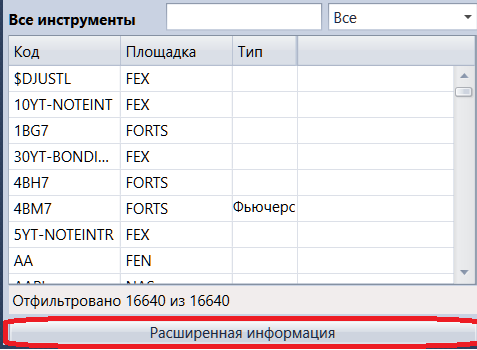

# Расширенная информация по инструменту

Расширенной информацией может являться любая необходимая информация по инструменту (например, страна, город, сайт и др.).

Более подробно о расширенной информации можно узнать в пункте [Расширенная информация](HydraExtensionInfo.md) документации по [Hydra](Hydra.md).
