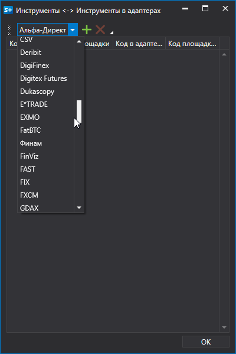

# Сопоставление инструменты\-подключения

Один и тот же инструмент в разных торговых системах может называться по\-разному. Существует возможность сопоставить инструмент и подключения, через которые будет торговаться этот инструмент, и указать как он идентифицируется во внешней торговой системе. Это полезно, когда идёт торговля одним инструментом на разных торговых площадках или через разные подключения (или брокеров). Также это дает возможность получать данные из одного подключения, а сделки совершать через другое подключение.

Сопоставить инструменты и подключения можно, нажав кнопку **Инструменты и подключения** нна панели **Все инструменты**.

В появившемся окне, нажав на кнопку , добавится новая строчка.

В столбце **Подключение** из выпадающего списка необходимо выбрать подключение. В столбцах **Код инструмента** и **Код площадки** указать код инструмента и код площадки, как они указаны в **Дизайнере**. В столбцах **Код инструмента адаптере** и **Код площадки в адаптере** необходимо указать код инструмента и код площадки как они указаны во внешней торговой системе.

## См. также
