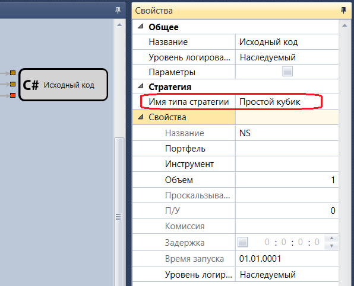

# Исходный код

Кубик используется для добавления кубиков, созданных из исходного кода([Использование C\#](Designer_Creating_strategy_from_code.md)). 

#### Параметры

Параметры

- **Имя типа стратегии** – имя типа стратегии, которую необходимо добавить.

## См. также

[DLL стратегия](Designer_DLL_Strategy.md)
