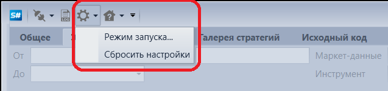
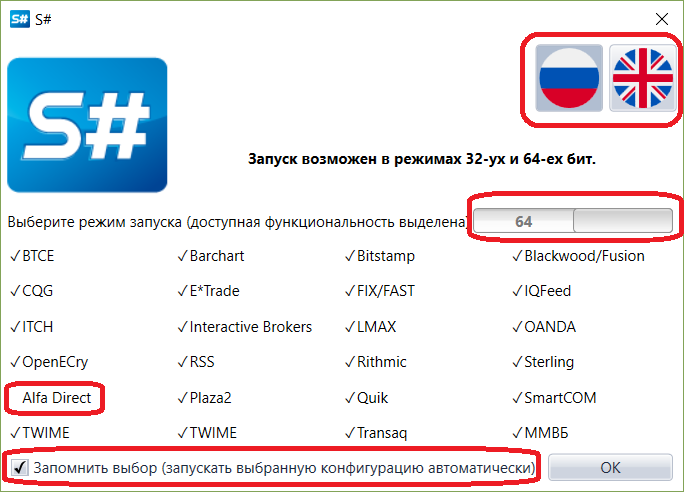

# Режим запуска

На **Панели быстрого доступа**, по умолчанию расположенной в верхней части окна программы, находится кнопка **Настройки** . При нажатии на кнопку  появится возможность сменить режим запуска программы, язык интерфейса или полностью сбросить настройки.

При выборе **Режим запуска** появится окно, в котором можно сменить язык интерфейса. Режим запуска возможен в режимах 32\- и 64\-бит, при выборе режима запуска доступная функциональность будет выделена значком  например, при 64\-битном режиме могут быть недоступны некоторые подключения (выделены в окне).

При выборе **Запомнить выбор** последующие запуски программы будут с установленными настройками.

## См. также

[Сброс языка и настроек](Designer_Reset_language_settings.md)
