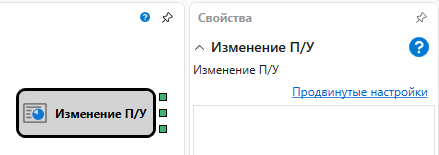

# Изменение П\/У

Кубик используется для получения изменений по прибыли\/убытку и комиссии 

### Исходящие сокеты

Исходящие сокеты

- **П\/У нереализованная** – числовое значение нереализованной прибыли\/убытка.
- **П\/У реализованная** – числовое значение реализованной прибыли\/убытка.
- **Комиссия** – числовое значение комиссии.

## См. также

[Уведомление](Designer_Notice.md)
