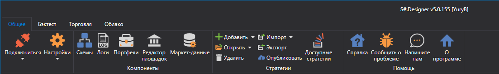
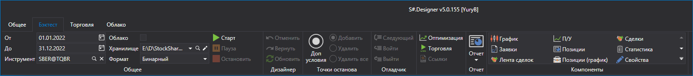
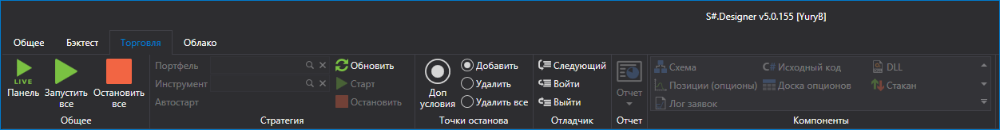
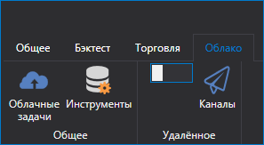
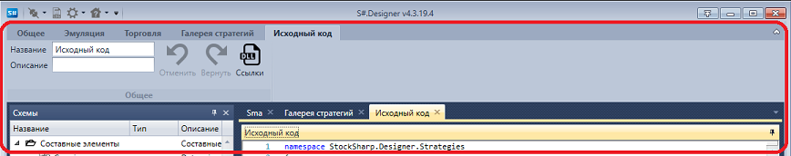

# Лента

Главный элемент пользовательского интерфейса [S\#.Designer](Designer.md) представляет собой **Ленту**, которая идет вдоль верхней части окна приложения. С помощью ленты можно быстро находить необходимые команды. Команды упорядочены в логические группы, собранные на вкладках. Для перехода к нужной вкладке достаточно щелкнуть по ее названию (имени). Каждая вкладка связана с видом выполняемого действия.

1. Вкладка **Общие**, которая открывается по умолчанию после запуска, содержит элементы, которые могут понадобиться на начальном этапе работы. С вкладки **Общие** можно открыть [Панель Схемы](Designer_Panel_Schemas.md), [Панель Логи](Designer_Panel_Logs.md), [Портфели](Designer_Panel_Portfolios.md), [Создание хранилища исторических данных](Designer_Creating_repository_of_historical_data.md), [Галерея стратегий](Designer_Gallery_of_strategies.md), [Панель стратегий](Designer_Panel_strategies.md), [Оптимизация](Designer_Optimization.md). А также на вкладке **Общие** можно выбрать Тему внешнего оформления [S\#.Designer](Designer.md).

2. Вкладка **Эмуляция**, автоматически открывается при выборе стратегии на панели [Схемы](Designer_Panel_Schemas.md). На вкладке **Эмуляция** расположены основные элементы по созданию стратегии, отладке, тестированию стратегий.([Создание стратегии](Designer_Creation_strategy.md), [Пример тестирования на истории](Designer_Example_of_backtesting.md))

3. Вкладка **Торговля** предназначена непосредственно для реальной торговли. Подробно о настройках подключения написано в пункте [Настройки подключения](Designer_Connection_settings.md). О реальной торговле с помощью [S\#.Designer](Designer.md) описано в пункте [Live торговля](Designer_Live_trade.md).

4. Вкладка **Галерея стратегий**. [S\#.Designer](Designer.md) дает возможность не только создавать стратегии, но и публиковать их. А также скачивать уже готовые стратегии, опубликованные другими пользователями. Подробно о **Галерее стратегий** описано в пункте [Галерея стратегий](Designer_Gallery_of_strategies.md).

5. Вкладка **Исходный код**, автоматически открывается при выборе содержимого папки **Исходный код** на панели [Схемы](Designer_Panel_Schemas.md). Подробно о создании стратегий из кода описано в пункте [Использование C\#](Designer_Creating_strategy_from_code.md).

## См. также

[Рабочая область](Designer_Workspace.md)
