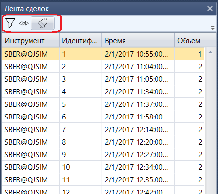

# Лента сделок

Компонент **Лента сделок** представляет собой таблицу со сделками, в которой отображается полная информация о всех сделках по выбранным инструментам.

**Лента сделок** имеет фильтр для выбора необходимых инструментов. Также имеется возможность настроить уведомления по событиям выбранных инструментов [Настройки уведомлений](Terminal_Notifications.md).

