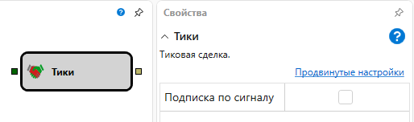

# Тики

Кубик используется для получения **Тиковых** данных по инструменту. 

### Входящие сокеты

Входящие сокеты

- **Инструмент** – инструмент, для которого необходимо получать **Level1** данные.

### Исходящие сокеты

Исходящие сокеты

- **Тик** – тиковая сделка.

### Параметры

Параметры

- **Подписка по сигналу** – подписаться на данные только после прихода триггера.

## См. также

[Индекс](Designer_Index.md)
