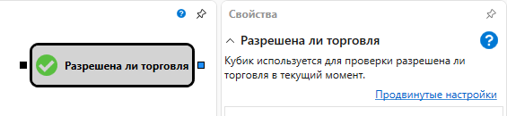

# Разрешена ли торговля

Кубик используется для проверки разрешена ли торговля в текущий момент. Проверяются следующие условия:

- Все подписки стратегии на маркет-данные должны быть в состоянии [Онлайн](API_ConnectorsSubscriptions.md) (получать данные реального времени).
- Все индикаторы должны быть [сформированы](Indicators.md).
- В случае [live торговли](Designer_Add_strategy_Live_trade.md) пришедшенее значение в триггер должно иметь метку времени большее, чем время запуска стратегии.

### Входящие сокеты

Входящие сокеты

- **Триггер** \- сигнал, с помощью которого определяется момент, когда необходимо выполнять проверку.

### Исходящие сокеты

Исходящие сокеты

- **Флаг** \- флаг, который определяет активна ли торговая сессия.

## См. также

[Текущее время](Designer_Time.md)
