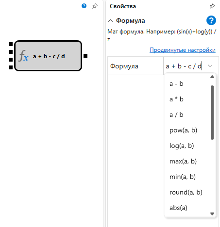

# Формула

Кубик используется для вычисления математической формулы с произвольным количеством аргументов. Формулу можно выбрать как из имеющегося списка, так и написать собственную. При написании собственной формулы количество входных сокетов определиться автоматически. 

### Входящие сокеты

Входящие сокеты

- **Значение** – значение, над которым можно проводить математические операции (например, число или индикатор). Количество входных значений зависит от формулы.

### Исходящие сокеты

Исходящие сокеты

- **Результат** – вычисленное значение математической формулы.

### Параметры

Параметры

- **Формула** – предопределенный набор математических формул.

## См. также

[Стакан](Designer_Depth.md)
