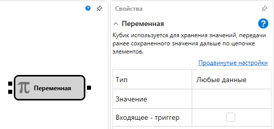

# Переменная

Кубик используется для хранения значений, передачи ранее сохраненного значения дальше по цепочке элементов.

#### Входящие сокеты

Входящие сокеты

- **Любые данные** – значение выбранного типа, которое будет сохранено вместо значения по умолчанию.
- **Триггер** – сигнал, с помощью которого определяется момент, когда необходимо передать хранящееся значение через выходной параметр.

#### Исходящие сокеты

Исходящие сокеты

- **Любые данные** – значение выбранного типа передаваемых данных.

#### Параметры

Параметры

- **Тип данных** – тип хранимых данных внутри переменной, от выбранного типа данных зависит тип входного и выходного параметра.
- **Значение** – значение по умолчанию, которое хранится в переменной. Данное значение используется, если на вход элемента не поступало других значений.
- **Обрабатывать при запуске** – при установленном флажке значение будет передаваться при запуске стратегии.

При выбранном типе данных **Инструмент** или **Портфель**, значение по умолчанию может отсутствовать. В этом случае, если в свойствах установлен флаг **Параметры**, при запуске стратегии на выполнение, эти данные будут взяты из соответствующих свойств стратегии.

## См. также

[Индексатор](Designer_Indexer.md)
