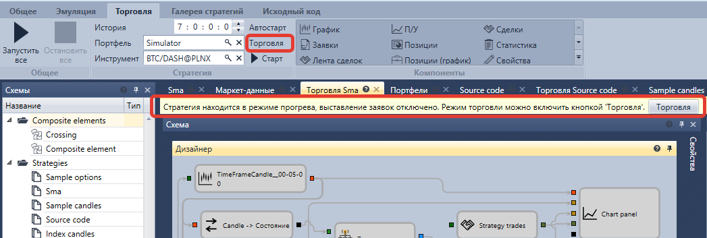

# Режим прогрева стратегии

При переходе из режима проектирования стратегии в режим торговли у всех стратегий установлен режим прогрева, о чем сообщает строка над схемой стратегии.

В режиме прогрева выставление заявок отключено. Например, если запустить стратегию в режиме прогрева, то при поступлении сигнала заявка отправлена не будет. Это сделано для того, чтобы стратегия полностью проинициализировала свое состояние, не совершая торговые операции на исторических данных.

Для включения или выключения режима прогрева необходимо нажать кнопку **Торговля**. Режим прогрева можно устанавливать и отключать у стратегии в любое время, не важно, запущена ли стратегия в торговлю или нет.

Рекомендуется запускать стратегию в следующем порядке:

1. Запустить стратегию в торговлю в режиме прогрева
2. Дождаться получения всех исторических данных, если это требуется для стратегии
3. Выбрать подходящий момент для выхода из режима прогрева
4. Выйти из режима прогрева

## См. также

[Настройки подключения](Designer_Connection_settings.md)
