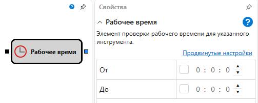

# Рабочее время

Кубик используется для определения рабочего времени для стратегии. Например, для определения, когда идут торги по определенному инструменту или когда стратегии разрешено торговать.
#### Входящие сокеты

- **Любые данные** \- кубик принимает любое значение, но берет из него метку времени, которое затем сравнивается с параметрами кубика.
#### Исходящие сокеты

- **Флаг** \- флаг, который определяет удовлетворяет ли метка времени параметрам кубика (true) или нет (false).
#### Параметры

- **Время от** \- время начала рабочего времени.
- **Время до** \- время окончания рабочего времени.

Кубик может использоваться для определения момента, когда торги ведутся по нескольким инструментам с различных торговых площадок.

## См. также

[Разрешена ли торговля](Designer_TradeAllowedDiagramElement.html)
