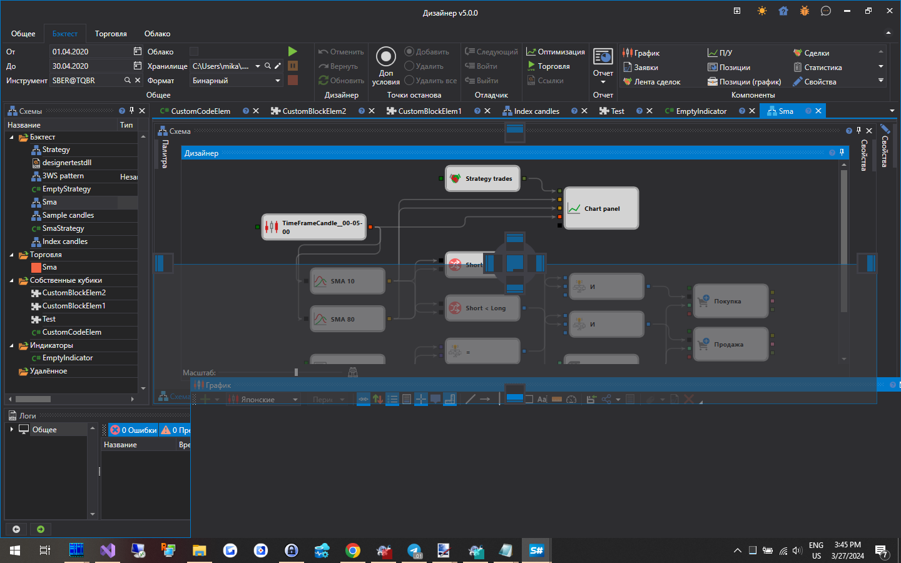

# Рабочая область

**Рабочая область** является оконным интерфейсом с закреплением панелей, наподобие той, что используется в Microsoft Visual Studio. Нажав на заголовке панели левой кнопкой мыши, и удерживая ее, можно закрепить панель в удобном месте. А захватив край панели, можно регулировать высоту или ширину панели:

## См. также

[Панель Логи](Designer_Panel_Logs.md)
