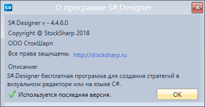
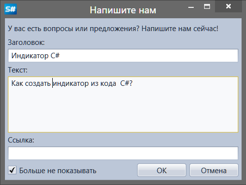

# Обратная связь

На **Панели быстрого доступа**, по умолчанию расположенной в верхней части окна прграммы, находится кнопка **Справка**. При нажатии на кнопку  появится возможность открыть справку по работе с программой, информация о ней, отправить вопросы и предложения.

При выборе **Справка** в браузере откроется страница справки по работе с программой.

При выборе **О программе** можно посмотреть информацию о программе, текущую версию, наличие обновлений.

При выборе **Напишите нам** откроется окно обратной связи для ввода вопросов и предложений.

