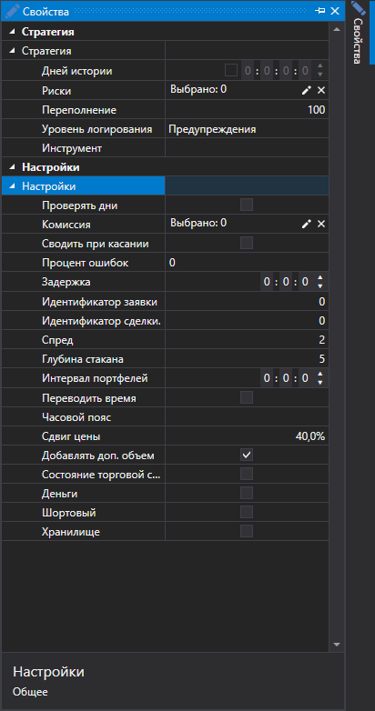

# Симулятор торгов

Присутствует возможность запустить программу в режиме **Симуляции**, для дополнительной настройки **Симуляции** необходимо выполнить следующие действия:

1. При нажатии на стрелку возле кнопки **Подключиться**  появится кнопка **Настройки эмуляции**:

2. При нажатии на кнопку **Настройки эмуляции**, появится окно **Настройки эмуляции**:

1.**Симулятор**

- **Использовать эмуляцию** – Использовать эмуляцию.
- **Инструменты** – Инструменты.

2. **Настройки**

- **Сводить при касании** – При эмулировании сведения по сделкам, производить сведение заявок, когда цена сделки коснулась цены заявки (равна цене заявки).
- **Стакан (время жизни)** – Максимальное время, которое стакан находится в эмуляторе. Если за это время не произошло обновление, стакан стирается. Это свойство можно использовать, чтобы убирать старые стаканы при наличии дыр в данных.
- **Процент ошибок** – Процентное значение ошибки регистрации новых заявок. Значение может быть от 0 (не будет ни одной ошибки) до 100.
- **Задержка** – Минимальное значение задержки выставляемых заявок.
- **Перерегистрация** – Поддерживается ли перерегистрация заявок в виде одной транзакции.
- **Период буферизации** – Отправлять ответы интервально целым пакетом. Эмулируется сетевая задержка и буферизированная работа биржевого ядра.
- **Идентификатор заявки** – Число, начиная с которого эмулятор будет генерировать идентификаторы для заявок.
- **Идентификатор сделки** – Число, начиная с которого эмулятор будет генерировать идентификаторы для сделок.
- **Транзакция** – Число, начиная с которого эмулятор будет генерировать идентификаторы для транзакций заявок.
- **Размер спреда** – Размер спреда в шагах цены. Используется при определении спреда для генерации стакана из тиковых сделок.
- **Глубина стакана** – Максимальная глубина стакана, который будет генерироваться из тиков.
- **Количество шагов объема** – Количество шагов объема, на которое заявка больше тиковой сделки. Используется при тестировании на тиковых сделках.
- **Интервал портфелей** – Интервал перерасчета данных по портфелям. Если интервал равен нулю, то перерасчет не выполняется.
- **Переводить время** – Переводить время для заявок и сделок в биржевое. 
- **Часовой пояс** – Информация о временной зоне, где находится биржа.
- **Сдвиг цены** – Сдвиг цены от последней сделки, определяющие границы максимальной и минимальной цен на следующую сессию.
- **Добавлять доп. объем** – Добавлять дополнительный объем в стакан при выставлении заявок с большим объемом.
- **Состояние торговой сессии** – Проверять торговое состояние.

## См. также

[График](Designer_Chart.md)
